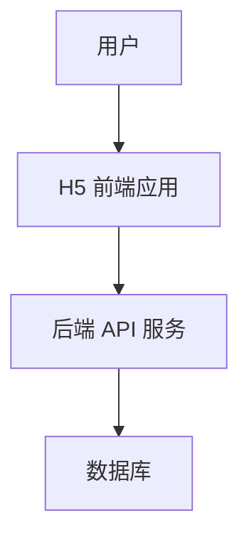

# 系统模式 (systemPatterns.md)

## 系统架构

本项目采用前后端分离的架构，前端负责用户界面和交互逻辑，后端提供 API 接口进行数据服务。

## 关键技术决策

*   **单页面应用 (SPA)：** 采用 Vue.js 构建 SPA，提供流畅的用户体验，减少页面加载时间。
*   **组件化开发：** 将 UI 拆分为可复用组件，提高开发效率和代码可维护性。
*   **路由管理：** 使用 Vue Router 进行前端路由管理，实现页面间的导航。
*   **状态管理：** 使用 Pinia (或 Vuex) 集中管理应用状态，确保数据流清晰可控。
*   **API 交互：** 使用 Axios 进行 HTTP 请求，统一处理 API 请求和响应。

## 设计模式

*   **组件模式：** 页面由多个独立、可复用的组件构成，每个组件负责特定的 UI 和功能。
*   **模块化：** 代码按功能模块进行组织，如 `views` (页面)、`components` (组件)、`store` (状态管理)、`api` (API 请求) 等。
*   **数据流模式：** 采用单向数据流，组件通过 props 接收数据，通过事件向上派发更新。

## 组件关系与实现路径

*   **页面级组件 (Views)：** 负责组合多个组件，并处理页面特有的业务逻辑和数据获取。例如 `CourseList.vue` 会调用 `api` 模块获取课程数据，并传递给 `CourseCard` 等子组件。
*   **通用组件 (Components)：** 独立于业务逻辑，可在不同页面复用。例如按钮、输入框、卡片等。
*   **状态管理 (Store)：** 存储全局状态，如用户登录信息、购物车数据、订单列表等。页面和组件通过 Store 获取和修改状态。
*   **API 封装：** 统一管理所有后端 API 请求，包括请求拦截、响应处理、错误捕获等。

## 关键实现路径

1.  **首页海报与导航：** 首页展示培训班海报，并提供“立即报名”按钮，引导用户进入报名流程。底部 Tabbar 提供核心模块的快速导航。
2.  **报名信息收集：** 根据个人或企业类型，收集必要的报名信息，提交后生成报名记录。
3.  **订单生成与关联：** 报名记录可以关联到现有订单，或生成新订单。一个订单可以包含一条或多条报名记录。
4.  **支付流程对接：** 实现个人支付（多渠道）和企业对公转账，并处理支付状态反馈和凭证上传。每个订单对应一个付款记录。
5.  **发票管理：** 一张发票可以对应多个付款记录。
6.  **订单与报名记录查询：** 用户可便捷查询个人或企业的订单详情、关联的报名记录和支付凭证。
7.  **客服支持：** 提供智能问答和人工文字留言，解决用户在报名、支付等环节遇到的问题。
8.  **API 交互：** 所有模块的数据交互均通过 API 接口进行，确保前后端分离。

## 模块衔接逻辑

*   用户从首页查看培训班海报开始，点击“立即报名”进入报名模块。
*   填写信息并提交后生成报名记录，并根据业务逻辑生成或关联订单，接着进入支付模块完成支付。
*   支付成功后可在“我的”模块中查询订单和关联的报名记录。
*   若在整个过程中遇到问题，可通过客服模块寻求帮助。

## 后续可细化功能（未来迭代）

*   在首页增加按时间、价格等筛选培训班的功能。
*   在报名模块添加企业内部的审批流程。
*   支付模块对接企业财务系统实现自动对账。
*   “我的”模块增加学习进度展示。
